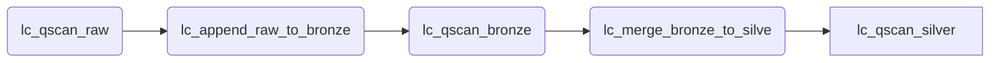

# Qualytics Airflow Examples

This repository contains the example code for an Airflow data engineering pipeline that loads a Snowflake lakehouse from an AWS S3 source.  The example uses the popular [Lending Club dataset](https://www.kaggle.com/datasets/wordsforthewise/lending-club) provided by Kaggle.  Qualytics scans are performed after each data load stage to identify, manage and remediate potential data anomalies.

# Repository Files
**/dags/snowflake_lc_demo.py**  : Airflow pipeline to for multi stage architecture. 
 This DAG performs the following steps: 
 - lc_qscan_raw : Perform Qualytics Data Store Scan on files in S3 to detect anomolies
 - lc_append_raw_to_bronze : Use Snowflake COPY to load file data into Snowflake "Bronze" table
 - lc_qscan_bronze : Perform Qualytics Data Store Scan on Snowflake "Bronze" table to detect anomolies
 - lc_merge_bronze_to_silver :Use Snowflake MERGE to refine data and load into Snowflake "Silver" table
 - lc_qscan_silverLoad : Perform Qualytics Data Store Scan on Snowflake "Silver" table to detect anomolies

**Update**
  ```
  QUALYTICS_API_BASE_URL = 'https://[ENV].qualytics.io/api/'
  os.path.dirname(__file__), '[REPO PATH]/qualytics-airflow-examples', 'qualytics')
 ```

**/qualytics/.env** : This file is not in the repository but need to be created.   It stores you Qualytics credentials
```
AUTH0_DOMAIN = "auth.qualytics.io"
AUTH0_AUDIENCE = "[Your Audience]"
AUTH0_ORGANIZATION = ""
AUTH0_CLIENT_ID = "[Your Client ID]"
AUTH0_CLIENT_SECRET = "[You Client Secret]"
```
> Contact Qualytics for details

**/qualytics/auth/get_token.py** : Calls Qualytics REST API to request an authentication Token for a Qualytics environment

**/qualytics/scan_functions/scan_data.py** : Calls Qualytics REST API to initation a SCAN operation
>  Note: The Qualytics code requires the following python modules:  jose, dotenv, requests, json


# Airflow Server

### Setup
>  - Install airflow.providers.snowflake.operators.snowflake on your Airflow server
>  - Configure Airflow Connections for Snowflake


